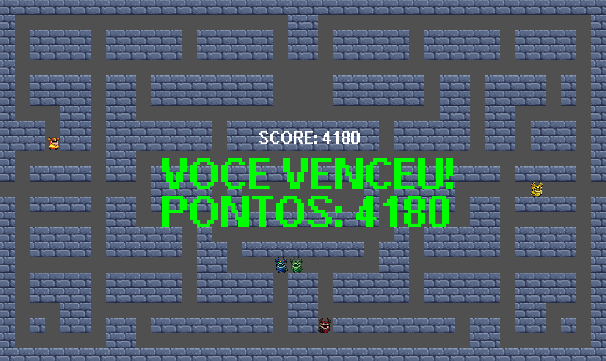
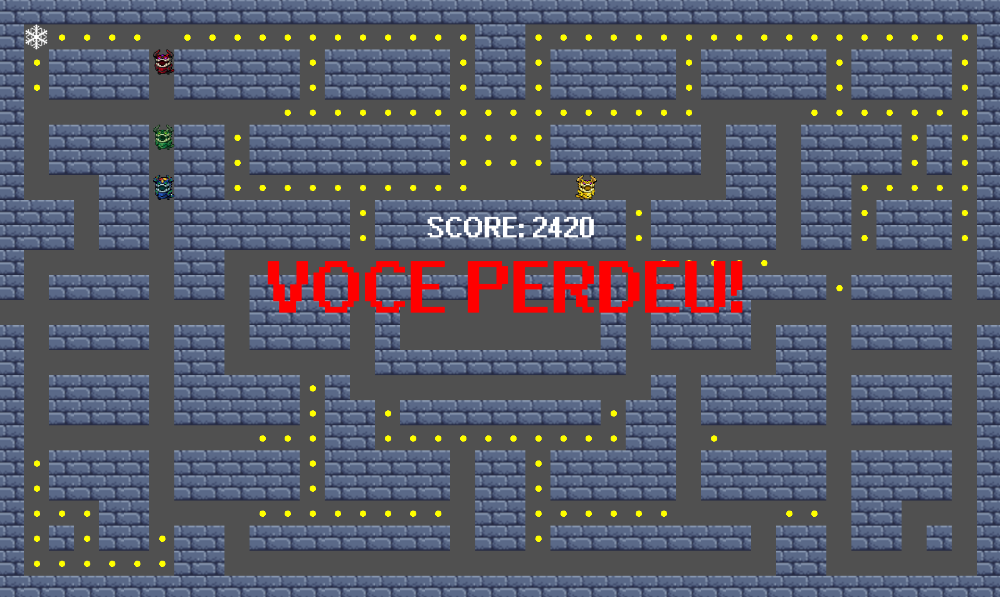
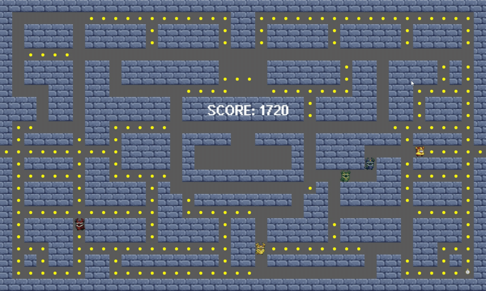
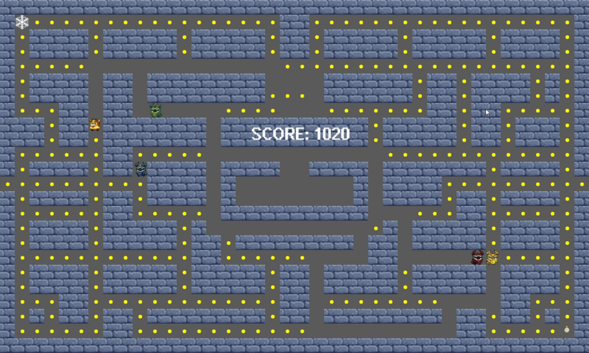

# PacMan Medieval
Jogo inspirado no clássico Pac-Man, desenvolvido em C++ utilizando a biblioteca SFML.
Nesta versão, o jogador controla um cavaleiro que deve coletar todas as moedas do mapa enquanto evita monstros controlados por diferentes tipos de inteligência artificial.

---

## Funcionalidades

- Movimentação em 4 direções (WASD)
- Sistema de pontuação
- Labirinto com coleta de itens
- Condições de vitória e derrota
- Túnel de teletransporte lateral
- Fantasmas com comportamentos distintos
- Poderes especiais (Congelamento e Desaceleração do Tempo)

---

## Compilação e execução
Compilar:
```bash
g++ 000tp3.cpp -o 000tp3.exe -IC:\SFML\include -LC:\SFML\lib -lsfml-graphics -lsfml-window -lsfml-system
```

Executar:
```bash
./000tp3.exe
```
---

## Gameplay

### Vitória


### Derrota


### Poder de câmera lenta (Relógio)


### Poder de congelamento (Floco de neve)


---

Projeto desenvolvido para a disciplina de Programação I da Universidade Federal de Viçosa (UFV).
